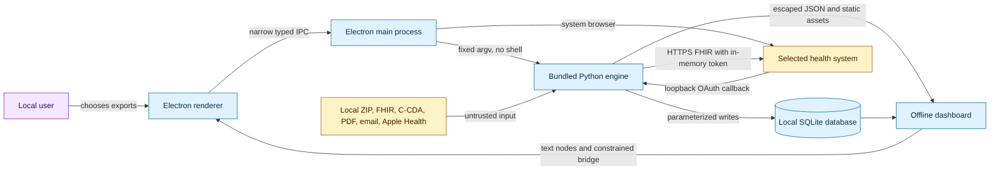
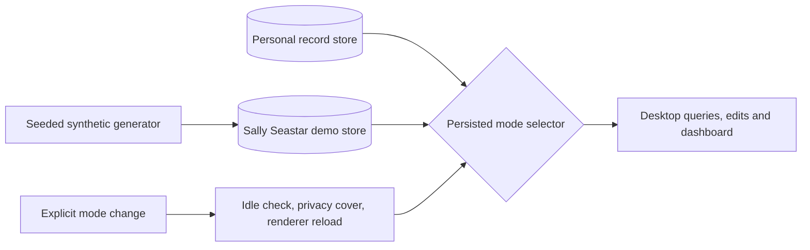
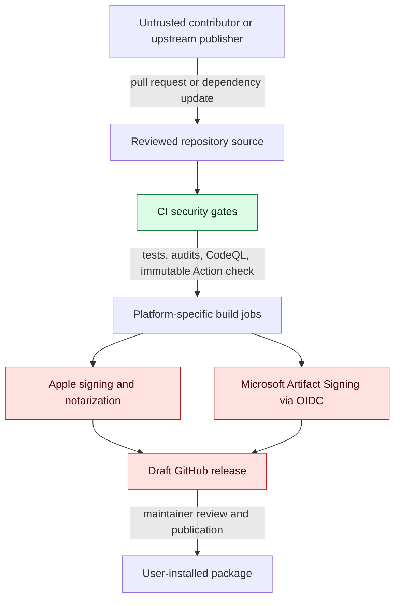

# Clippi-Health security model

## Executive assessment

Clippi-Health was assessed on September 29, 2026 as a local-first desktop application for one user on a single-user system. The review covered the Electron shell, Python record engine, import parsers, generated dashboard, SMART-on-FHIR flow, local server, packaging, installer release workflows, and declared JavaScript and Python dependencies.

No critical, high, or medium application-code vulnerability was confirmed under that operating model. The review found one low-severity release-supply-chain weakness: GitHub Actions were referenced by mutable version tags. Every Action is now pinned to a full commit SHA, and CI rejects future mutable references.

Live dependency checks found vulnerable archive utilities in Electron Forge's build graph and a vulnerable `pypdf` release. The vulnerable ZIP implementation was replaced by Electron's maintained internal extractor, Electron Rebuild was updated, unsafe temporary-file and tar chains were removed, and `pypdf` was updated from 6.7.0 to 6.19.0. One upstream `image-size` advisory remains accepted because it is reachable only through the macOS DMG builder and reads a repository-controlled background image; it never handles user records. CI permits only that advisory by identifier and fails on any new npm advisory.

The current posture is suitable for the stated local, single-user design, with defense in depth at the renderer, OAuth, import, data, and release boundaries. Security still depends on the operating-system account, upstream health systems, package registries, GitHub, and signing providers.

## System and data flow

Health records cross the main untrusted-input boundary only after the user selects a local export or starts a connector. The application has no hosted service or telemetry. The optional dashboard server binds to loopback; any separate Tailscale exposure is a user-managed deployment choice outside the bundled helper.

## Trust boundaries

### Demonstration privacy

The desktop **Try demo** mode uses a separate, marked store populated entirely by a seeded synthetic generator. Personal records are not inputs to generation. The persisted mode selects the store for queries, edits and dashboard serving; a missing demo store does not fall back to personal data. Switching requires idle IPC, hides the previous screen, and reloads the renderer to discard cached panels and logs. Generation failures retain the previous selection behind a privacy cover. Personal file imports, OAuth, source configuration, root changes and external windows are blocked in demo mode in both UI and main-process IPC. The generator refuses unmarked nonempty folders and symbolic links. Demo logs and diagnostics omit local filesystem paths.

This is a recording aid, not an access-control boundary against the local account. Manually entered demo notes can contain whatever the user types. Other apps, an already-open standalone dashboard and an independently served Tailscale dashboard are outside this mode. The operating system and the user still control screen sharing. See [demo behavior and verification](docs/DEMO.md).

| Boundary | Untrusted or privileged input | Primary controls |
|---|---|---|
| Imported records | ZIP members, FHIR, C-CDA/XML, PDF, DOCX, HTML, email and Apple Health data | Archives are read without extracting paths; SQL is parameterized; imported strings render as text; source provenance is retained |
| Renderer to host | Dashboard and renderer content requesting filesystem or process work | Electron sandbox, context isolation, Node integration disabled, narrow preload API, fixed IPC handlers |
| SMART OAuth | Browser callback, discovery metadata, tokens, FHIR pages | Public-client PKCE S256, random state, fixed loopback redirect, HTTPS validation, redirect refusal for authenticated requests, same-server pagination, in-memory tokens |
| Local storage | Health records, curated notes, dashboard and source files | User-selected private data root, Git ignores, read-only query path, no hosted synchronization |
| Build and release | npm/Python packages, GitHub Actions, signing systems | Lockfiles and exact Python pins, full Action SHAs, dependency audits, CodeQL, least-privilege job permissions, signed-release fail-closed checks |

## Attacker model

The model includes:

- a malicious record, attachment, archive member, FHIR response, or provider metadata returned from a source the user chooses;
- a compromised or malicious upstream package or GitHub Action;
- a public repository contributor attempting to influence CI or release output; and
- a remote site interacting with the system browser during SMART authorization.

The model assumes the attacker does not already control the user's operating-system account, local health-data root, GitHub maintainer account, or signing accounts. Once the local user account is compromised, Clippi-Health cannot provide a stronger isolation boundary than that account. Physical-device security, full-disk encryption, backups, Tailscale policy, and health-system account recovery remain the user's or platform's responsibility.

## Controls verified in the application

### Desktop boundary

- Renderer windows use `contextIsolation: true`, `sandbox: true`, and `nodeIntegration: false`.
- The preload exposes a small, named API instead of Electron or Node primitives.
- Content Security Policy limits renderer resources, and imported values are inserted with `textContent` or text nodes.
- Python processes use fixed executable paths and argument arrays without a command shell.
- Developer smoke screenshots are created under a random private directory with exclusive `0600` files because they can contain rendered health data.

### Record processing

- ZIP and document archives are inspected in place rather than extracted to attacker-selected paths.
- Database operations use parameterized SQL for imported values and ordinary queries.
- Record-store marker creation is exclusive and atomic, avoiding a check-then-write filesystem race.
- Generated dashboard JSON escapes script terminators before embedding.
- Original resources and provenance are retained so normalized data can be traced back to evidence.

### Connector and network behavior

- SMART profiles require HTTPS endpoints and use OAuth authorization code flow with PKCE.
- Callback state is compared before exchanging a code, and the redirect target is fixed to loopback.
- Bearer-authenticated requests do not follow arbitrary redirects, and FHIR pagination stays on the configured server.
- OAuth tokens remain in memory for the one-shot import and are discarded when the helper exits.
- There is no Google, Microsoft email, analytics, telemetry, or hosted Clippi-Health service integration.

### Build and release integrity

- Every third-party GitHub Action is pinned to a full 40-character commit SHA.
- `scripts/audit_workflows.py` prevents mutable Action tags from returning.
- Dependabot tracks npm, Python, and GitHub Actions every week and groups related updates.
- `pip-audit` checks the complete pinned Python build/runtime set.
- The complete npm graph is audited, including build dependencies; CI permits one documented build-only advisory and fails on any other advisory.
- Dependency Review blocks newly introduced high-severity dependencies in pull requests.
- CodeQL runs extended JavaScript/TypeScript and Python security queries on pushes, pull requests, a weekly schedule, and manual runs.
- Release jobs use explicit least-privilege permissions. Apple and Microsoft signing jobs fail when required configuration is absent, and releases are created as drafts for review.

## Dependency assessment

| Ecosystem | Result after remediation | Continuous control |
|---|---|---|
| Installed npm runtime | No known advisories | Full npm audit in CI and Dependabot |
| Electron build graph | Critical `tar` and unsafe `tmp` chains removed; vulnerable `extract-zip` implementation replaced by Electron's maintained internal extractor | Full-graph audit and lockfile updates |
| Python runtime/build | `pypdf` updated to 6.19.0; current pinned set passes `pip-audit` | `pip-audit` and Dependabot |
| GitHub Actions | Mutable major tags replaced by immutable SHAs | Pin audit and Dependabot |
| Vendored Plotly | Browser-only basic bundle is version 4.1.1; it is newer than the 2.25.2 prototype-pollution fix and its release addresses CVE-2026-85061 | Manual advisory and provenance review when the vendored asset changes |

## Residual risks and limits

1. **Accepted DMG-builder denial of service.** `image-size` 0.7.5 has an infinite-loop advisory for crafted ICNS input. Its only path is `@electron-forge/maker-dmg` → `electron-installer-dmg` → `appdmg`; Clippi-Health supplies its own reviewed background image. The dependency cannot read imported medical files. This exception should be removed when the upstream DMG tool adopts a compatible fixed parser or is replaced.
2. **Resource exhaustion from deliberately imported files.** Several parsers necessarily process user-selected, potentially large records. Existing size checks reduce archive risk, but a malformed PDF, XML document, or very large export may still consume substantial CPU or memory. Under the single-user model this is usually a local availability issue. Parser limits and subprocess isolation remain useful future hardening.
3. **Local account compromise.** Application data is readable to processes running as the same user. The product relies on operating-system login security, disk encryption, and normal endpoint protection.
4. **Provider and browser trust.** A connector relies on the selected provider's authorization and FHIR endpoints and on the system browser. The app limits redirects and tokens but cannot guarantee provider-side correctness.
5. **Static-review limits.** The assessment did not line-review minified Plotly source and could not perform an independent parallel review in the scan session. Dynamic dependency databases, tests, package builds, and CI checks complement that static review.

Plotly references: [GHSA-wjc4-73q6-gv3m](https://github.com/advisories/GHSA-wjc4-73q6-gv3m) and the official [Plotly.js 4.1.1 release](https://github.com/plotly/plotly.js/releases/tag/v4.1.1).

## Security invariants for future changes

- Health data and credentials stay local unless the user explicitly connects to the selected health system.
- Imported content is data and never becomes code, HTML, SQL, a shell command, or an unrestricted filesystem path.
- OAuth client secrets are never shipped; public clients use PKCE and loopback callbacks.
- The renderer never receives Node, filesystem, process, or token primitives.
- Network listeners bind to loopback unless a separate, explicit user-managed tool exposes them.
- Release dependencies are immutable during a workflow run, and signing authority is granted only to the job that needs it.
- CI audits the entire dependency graph, including tools used to create installers.

## Assessment record

The source scan reviewed commit `3cc8818cadf04ab6d92e0d8fbb04433f3d530d59` and used a repository-wide static analysis followed by live npm and Python advisory checks. Seven security surfaces were inventoried: Electron boundaries, import parsers, SMART OAuth, dashboard generation, local CLI/server behavior, packaging/release, and dependency manifests. The source finding—mutable GitHub Action references—was remediated in the follow-up changes documented above. The first live CodeQL run additionally identified predictable smoke screenshot paths and check-then-write marker creation; both were hardened. Its clear-text finding covers the intended output of the local `hp summary` command, which displays the user's requested patient summary directly to that same user rather than writing a log.

This document describes the architecture and controls at the time of its last update. `SECURITY.md` contains the private reporting process.
